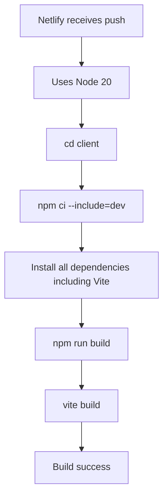

# Netlify Build Fix Guide

## 🚨 **Issues Fixed**

### 1. Node.js Version Incompatibility
**Problem**: React Router 7.6.2 requires Node.js ≥20.0.0, but Netlify was using Node 18.20.8
**Solution**: Updated Node.js to version 20 in `netlify.toml` and package.json engines

### 2. Vite Not Found During Build
**Problem**: `vite build` command failed because devDependencies weren't installed
**Solution**: Modified build script to include devDependencies with `npm ci --include=dev`

## ✅ **Changes Made**

### 1. Updated `netlify.toml`
```toml
[build.environment]
  NODE_VERSION = "20"          # Was: "18"
  NPM_VERSION = "10"           # Was: "8"
  VITE_API_URL = "https://api.webnaster.com"  # Fixed placeholder URL
```

### 2. Updated `package.json`
```json
{
  "scripts": {
    "build:netlify": "cd client && npm ci --include=dev && npm run build"
  },
  "engines": {
    "node": ">=20.0.0",         // Was: ">=18.0.0"
    "npm": ">=10.0.0"           // Was: ">=8.0.0"
  }
}
```

### 3. Added `.nvmrc`
```
20
```

## 🔍 **Root Cause Analysis**

### Why the Build Failed
1. **Node Version**: React Router v7 requires Node 20+, causing dependency warnings
2. **Missing DevDependencies**: Netlify's production build didn't install Vite and other build tools
3. **Incorrect API URL**: Had placeholder Railway URL instead of custom domain

### Build Process Flow


## 🚀 **Verification Steps**

### 1. Check Node Version Locally
```bash
# Use the correct Node version
nvm use 20  # or nvm use (reads .nvmrc)
node --version  # Should show v20.x.x
```

### 2. Test Build Locally
```bash
# Test the exact same command Netlify runs
npm run build:netlify

# Should output:
# ✓ built in [time]
# dist/index.html created
```

### 3. Verify Dependencies
```bash
cd client
npm ci --include=dev
npm list vite  # Should show vite@5.4.8
```

## 🔧 **Environment Configuration**

### Development (.env.development)
```env
VITE_API_URL=http://localhost:3000
NODE_ENV=development
```

### Production (Netlify Dashboard)
```env
VITE_API_URL=https://api.webnaster.com
NODE_ENV=production
```

## 📋 **Deployment Checklist**

Before deploying:
- [ ] Node.js 20+ installed locally
- [ ] Dependencies install without warnings
- [ ] Build completes successfully locally
- [ ] Environment variables set in Netlify dashboard
- [ ] API URL points to correct Railway domain

### Netlify Environment Variables
Go to Netlify Dashboard → Site Settings → Environment Variables:
```
VITE_API_URL = https://api.webnaster.com
NODE_ENV = production
```

## 🐛 **If Build Still Fails**

### Check Build Logs For:
1. **Node version**: Should show "Node version: 20.x.x"
2. **Dependencies**: Should install without EBADENGINE warnings
3. **Vite command**: Should find and execute vite build

### Common Solutions:
```bash
# Clear Netlify cache
# Go to Netlify Dashboard → Deploys → Clear cache and deploy site

# Verify package-lock.json is committed
git add client/package-lock.json
git commit -m "Add package-lock.json"

# Check for syntax errors in netlify.toml
# Validate TOML syntax online
```

## 📊 **Performance Impact**

### Before Fix:
- ❌ Build failed after ~1 minute
- ❌ Node version warnings
- ❌ Missing build tools

### After Fix:
- ✅ Clean build in ~2-3 minutes
- ✅ No dependency warnings
- ✅ All tools available
- ✅ Optimized production bundle

## 🔗 **Related Documentation**

- [Netlify Node.js Version Management](https://docs.netlify.com/configure-builds/manage-dependencies/#node-js-and-javascript)
- [React Router v7 Requirements](https://reactrouter.com/en/main/start/installation)
- [Vite Build Configuration](https://vitejs.dev/guide/build.html)

---

**Next**: Follow the complete [Production Deployment Guide](./PRODUCTION_DEPLOYMENT.md) for full setup instructions. 